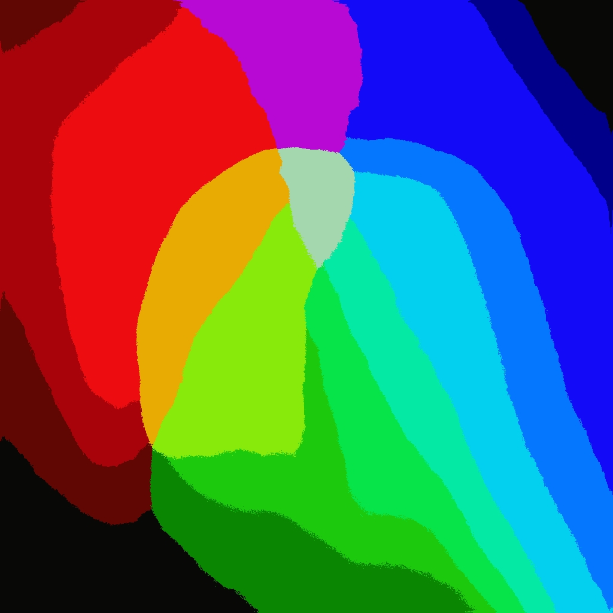
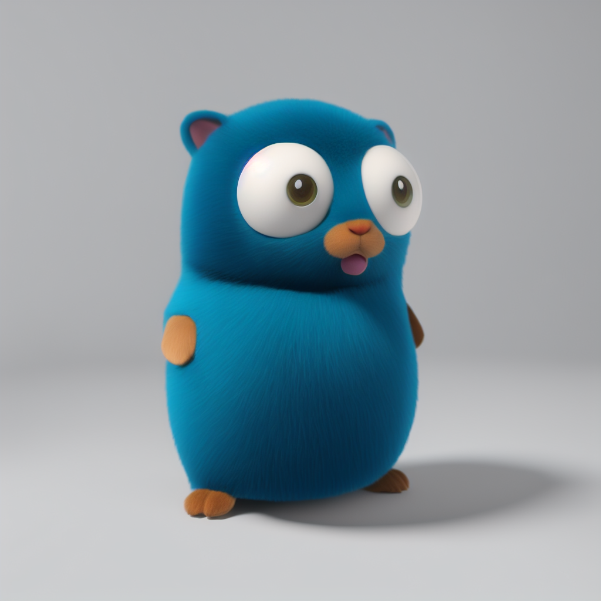

# Go K-Means Image Color Separation/Dominant Color Finder written in Go

This is a command-line program written in Go which performs color quantization on images and identifies the dominant colors in them.

## Features

- Color quantization using K-means clustering
- Identification of dominant colors in images
- Output is provided in JSON and HTML formats
- Supports JPEG and PNG image formats
- Using Go standard library only

## Usage

To use the program, you need to provide the input file or directory as a command-line argument. You can also specify the number of prominent colors to find and the color value format (hex or rgb) using flags:

```terminal
go run main.go <input_file_or_directory>

# Or run as binary after 'go build'

gokmeans <input_file_or_directory>
```

```terminal
# Use -n to set number of dominant colors to find (based on higher percentage)
go run main.go -n 10 <input_file_or_directory>
```

### Sample Images

Sample HTML output: https://bradsec.github.io/gokmeans/

multicolor.png  




gopherblue.png  
  

